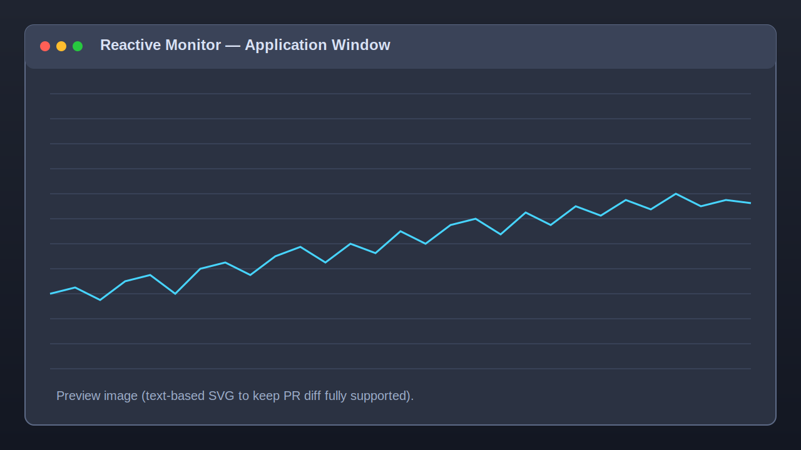

# 🛰️ Reactive Monitor — Standalone & Dev Build




Industrial-grade, real-time spectral monitoring for BladeRF hardware, with both a **single-click standalone app** and a **manual developer workflow**.

## Quick Start

1. **Download the latest release for your OS.**
2. **Unzip and double-click `automatic-detection`.**

## Features (Standalone version)

- ✅ No Python installation required.
- ✅ No Node.js installation required.
- ✅ Launches acquisition engine + API + UI automatically.
- ✅ Opens the interface in a native window (`PySide6 + Qt WebEngine`).

## Dev Section (for RF enthusiasts)

If you want to build, debug, or contribute to the codebase, use the manual path below.

### 1) System Dependencies

```bash
sudo apt update
sudo apt install -y build-essential cmake libbladerf-dev libfftw3-dev pkg-config
```

### 2) Build the Core Engine (C++)

```bash
cd cpp/sdr_core
mkdir -p build && cd build
cmake ..
make -j"$(nproc)"
```

### 3) Set Up Python Environment

```bash
pip install -r requirements.txt
```

### 4) Start the full system

```bash
./start_system.sh
```

## Standalone packaging (single-click)

```bash
python app_wrapper/build_standalone.py
```

The resulting launcher starts `sdr_core` + FastAPI in the background, assigns a dynamic port, and opens the React UI in a native desktop window.


## Vision & Roadmap

- [BladeEye Evolution — Plan Structural](docs/bladeeye_evolution_plan.md)
- [BladeEye Evolution — Varianta Recomandată de Implementare](docs/bladeeye_implementation_strategy.md)
- [Execution Board (Operațional)](docs/execution_board.md)
- [Foundation Phase Delivery](docs/foundation_phase_delivery.md)

## API endpoints (dev mode)

- Web UI: <http://localhost:8000>
- Bandwidth control: `PUT /api/config/bandwidth?value=<Hz>`
- Spectrum stream: `ws://localhost:8000/ws/spectrum/binary`

## Hardware requirements

- SDR: BladeRF (xA4/xA9/Micro)
- Connection: Shielded USB 3.0 (mandatory for bandwidth > 10 MHz)
- OS: Linux (Ubuntu 22.04+ recommended)
